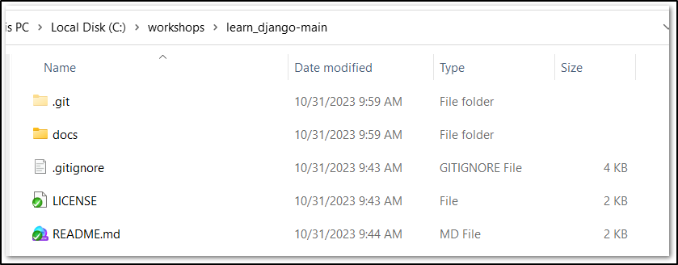

## Software Requirements

- [ ] **Install Python**

    - To check if python installed on your machine, open command prompt and run following command
    -  `python --version`
    - **OUTPUT**
        - If python is installed, `Python 3.10.0` (version number may change)
        - If python is NOT installed, `'python' is not recognized as an internal or external command, operable program or batch file.`
    - If you get the first output (version number), proceed to next step. OR if you get the second output (error message), please install python in your system. Follow steps (till step 4) as mentioned in [how-to-install-python-on-windows](https://www.geeksforgeeks.org/how-to-install-python-on-windows/)

- [ ] **Install django package**

  - Open command prompt Run any one of the following commands

    - `pip install Django`
      OR
    - `py -m pip install Django`

- [ ] **Install Visual Studio Code (VS Code)**

    - To check if VS Code installed on your machine, open command prompt and run following command
    - `code --version`
    - **OUTPUT**
        - If vscode is installed, `1.83.1` (version number may change)
        - If vscode is NOT installed, `'code' is not recognized as an internal or external command, operable program or batch file.`
    - If you get the first output (version number), proceed to next step. OR if you get the second output (error message), please install VSCode in your system. Follow steps (only 3 steps) as mentioned in [Running Visual Studio Code on Windows](https://code.visualstudio.com/docs/setup/windows)

## Download Sample Projects

1.  Create a folder `workshops` in **C** drive.
2.  Download the zip file which has sample Django projects. [download](https://github.com/gitruhul/learn_django/archive/refs/heads/main.zip)
3.  Once downloaded, copy the zip file to following location
    - `C:/workshops/`(you created this folder in step1)
4.  Extract the zip file into _C:/workshops/_ folder.
5.  Make sure your contents look like following screenshot

## Create First Django App

1. Open command prompt inside the path `C:\workshops\learn_django-main`
2. Run Following Command
    `django-admin startproject first_app`
3. Above command should have created a folder **first_app**
4. In the command prompt get into the first_app folder.
    `cd first_app`
5. Run the command
    `python manage.py runserver`
6. Look into console logs and open the URL in the browser.
7. When you get time read more [here](https://docs.djangoproject.com/en/4.2/intro/tutorial01/)
