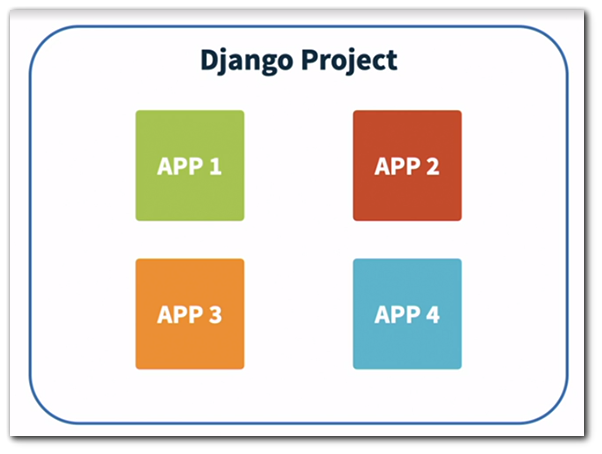

# Django Apps

In Django, a web framework for Python, a project and apps are two fundamental concepts used to organize and structure your web application. Let's explore the differences between them:

1. **Django Project:**

   * A Django project is the top-level container for your entire web application.
   * It represents the entire website or web application and contains the settings and configurations for the application.
   * The project is typically created when you run the django-admin startproject command, and it creates a project directory containing a set of files and directories, including the settings, URLs, and other configurations needed for the application.
   * You generally have one project for each web application you develop.
2. **Django Apps:**

* Django apps are smaller, reusable components that make up the functionality of your project.
* They are designed to be modular and can be used in multiple projects, enhancing code reusability.
* An app can include models, views, templates, and other components that serve a specific purpose within the project. For example, you might have separate apps for user authentication, blog posts, or a forum within your project.
* Apps are typically created using the python manage.py startapp command, and they are organized within a directory in your project.



**_Here's how they fit together:_**

* A Django project can consist of multiple apps, and each app contributes a specific piece of functionality to the overall project. For example, you might have a project for your e-commerce website and individual apps for user accounts, product catalog, and order processing.
* The project settings specify which apps are installed and how they interact. The project's URL configuration (urls.py) can route incoming requests to the appropriate app views.
* Apps should be designed to be self-contained and reusable. This means that you can take an app from one project and use it in another without much modification, promoting code modularity and maintainability.

In summary, a Django project is the high-level container that encompasses your entire web application, while apps are smaller, self-contained components within the project that provide specific functionalities and can be reused across different projects. The separation of your project into apps helps keep your code organized, maintainable, and scalable.

## Steps to add an app

### 1. Create app

   ```bash
   python manage.py startapp myapp1

Django creates a folder named myapp1 in the project. First, take a look at the file called views.py

### 2. Add/Update Views
    - Go to myapp1/views.py
    - Add following code
    - ```python
      from django.shortcuts import render
      from django.http import HttpResponse
      
      def members(request):
          return HttpResponse("Hello world!")


